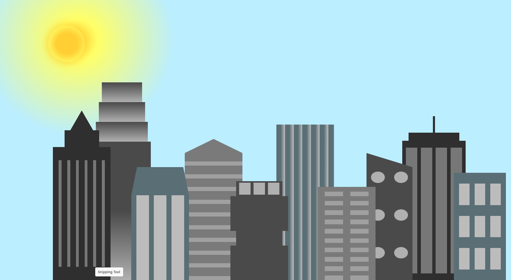

# 🌆 City Skyline  

This project is based on the City Skyline challenge from FreeCodeCamp, with additional custom tweaks added by me. It’s a simple and stylish city skyline built using HTML and CSS, featuring an animated skyline with a sun shining effect that I added for extra flair.
## 📸 Screenshot

Here’s what the City Skyline project looks like:


## Watch the Video

[](https://youtu.be/xbeN2go3G04)


## ✨ Features

    • Original FreeCodeCamp Project – Based on the FreeCodeCamp City Skyline challenge, with custom enhancements.
    • Sun Shining Effect – A custom animation added for the sun shining effect.
    • Custom Styling – Uses CSS to create a visually appealing skyline.
    • Responsive Design – Adapts to different screen sizes.
    • Animations – Smooth transitions and effects for a dynamic feel.

## 🛠️ Technologies Used

    • HTML5 – Page structure.
    • CSS3 – Styling, animation, layout design.

## 🚀 How to Run the Project  

1. **Clone the repository**:  
   ```bash
   git clone https://github.com/RusLena/City-skyline.git